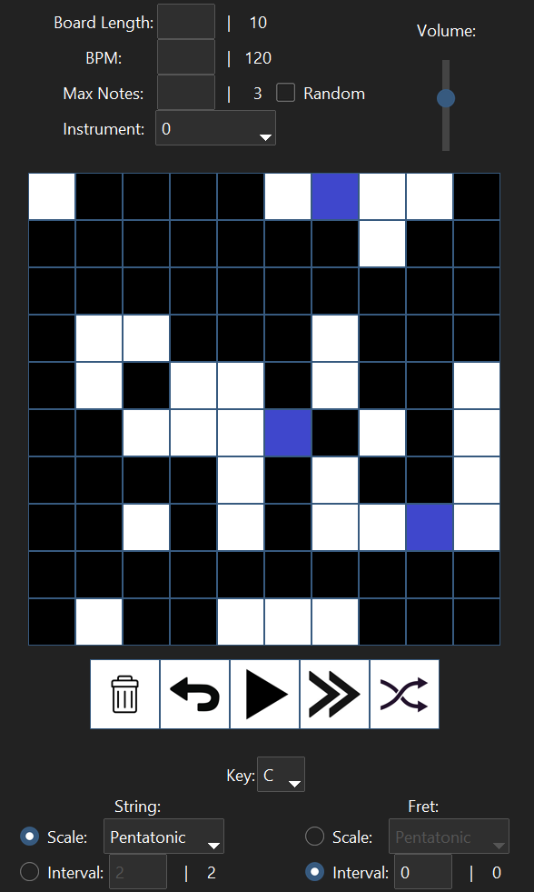

# Run App.py:
Through terminal or just double click application.

# Requires:
- tkinter
- ttkbootstrap
- PIL
- pygame

## Miscellaneous:
Board Length: 	3-30

BPM:		1-300

Max. Notes:	>= -1

When Max Notes = -1, all possible notes will play.

By default, the row with the most live tiles will play thier note. 
The "Random" checkbox negates this priority.

"Go Back" button loads board configuration since the last time "Play" button was pressed.

### Recommendations:

Don't have too many notes playing at once. I suggest keeping it less than 6.

"Insen" & "In" Scale: Turn on "Random"